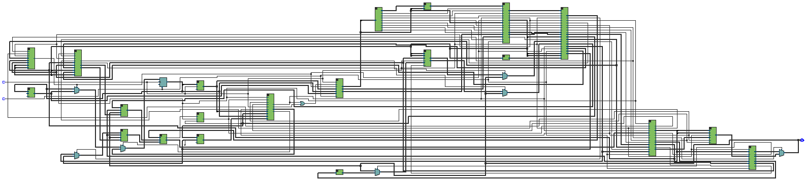
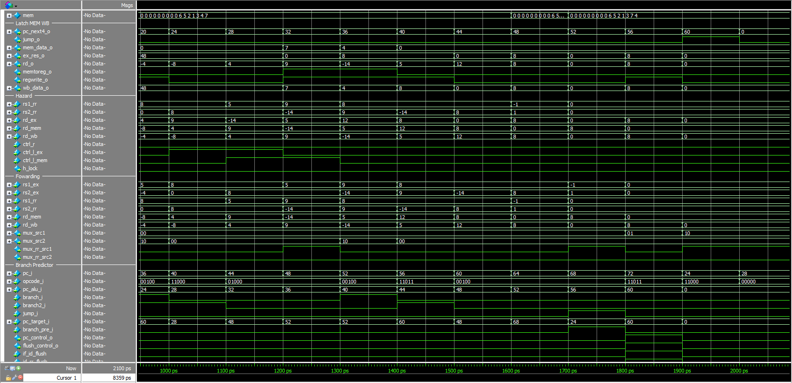

# The segmented single-cycle processor

## Abstract
A segmented single-cycle processor (or pipelined processor) is a type of central processing unit (CPU) design in computer architecture. In a pipelined processor, the execution of instructions is divided into several stages or segments, so each stage of processing is performed in a different clock cycle. Pipelining aims to increase processor efficiency by allowing multiple instructions to execute in parallel, thereby improving overall performance. The implementation was carried out using the Quartus environment, which is a software tool produced by Altera for the analysis and synthesis of designs made in Hardware Description Languages (HDL or Hardware Description Language), which for this project Verilog was used. To simulate internal signals, the ModelSim simulator was used, which is free and distributed by Altera. Finally, the Instruction Set Architecture (ISA) used was RISC-V, because it is available under an open source license, which allows anyone to implement and manufacture RISC-V-based hardware without intellectual property restrictions, encouraging innovation and collaboration in hardware development. This project is part of the courses offered by the [Largarto Initiative](https://lagarto.ipn.mx/) of the National Polytechnic Institute (IPN).

## Tools used
- Quartus 20.1.1.
- rars 1.6.

## Programming languages
- Verilog.
- Assembly.

## Features
### What does the project contain?
- **ALU:** It's the Arithmetic Logic Unit, which is responsible for performing all the logical and mathematical operations of the processor. Also sets a flag in case a branch occurs.
- **BJControl:** It's the unit that controls the program counter in case a branch exists.
- **BranchPredictor:** It's a unit that attempts to predict the outcome of conditional branches in the program code. The implementation in this project was to use a dynamic branch predictor, this means that it maintains a history of results of past branches and use this information to predict future branches. This predictor uses 4 confidence levels.
- **Decode:** It's the most complex unit of the processor. Controls how the stages after the register file stage should behave.
- **DecodeALU:** It's the unit that determines which operation the ALU should perform based on the type of instruction it detects.
- **Forwarding:** This unit manipulates some latches to avoid outdated values when executing an R or I type instruction followed by some other instruction that requires the value of some specific register.
- **FullAdder:** It's a 1-bit adder with carry in and carry out.
- **FullAdderN:** It's an unit that instance the full adder N times to generate adders greater than 1 bit.
- **Hazard:** This unit manipulates some latches to avoid outdated values when executing an L-type instruction followed by some other instruction that needs the value from data memory.
- **IMemory:** It's a memory that stores hexadecimal instructions and outputs them according to the program counter.
- **Latches** They're used to divide the processor into a series of stages. Each stage performs a specific operation, and multiple instructions can be in various stages of execution simultaneously.
- **Memory:** It's a simple data memory that interacts with the register file.
- **Monociclo:** It's the top-level entity that instantiates all the modules to form the unicycle processor.
- **mux_3_to_1:** This unit is a simple 3 to 1 multiplexer.
- **RegisterFile:** It's the unit that uses the registers to perform operations in the ALU.
- **SignExtend:** It's an unit that extends the data size for some instructions, preserving the sign of the data.
- **SignExtendPC:** It's an unit that extends the size of the program counter value.

### How to install the tools?
See the [software installation](docs/softwareInstallation.md)

### How to build and run the project?
See the [build information](docs/buildInformation.md)

### How to simulate bubble sort in the project?
See the [example information](docs/exampleInformation.md)

### How to use and develop instructions in rars?
See the [rars information](docs/rarsInformation.md)
